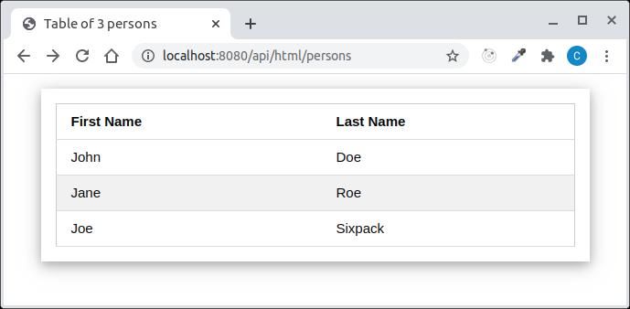

# Quarkus Hibernate and ORM made RESTEasy

The Application Server with the same JPA Entities and Data Access Objects.

Running
===

- There is a class Main in the at.htl.quarkus.demo package. Create a Java Application Project and use "Main" as the main class.

- Open http://localhost:8080/api for a list of possible requests.

Additionally to the JSON responses there is also an example how to use the qute templating engine and w3css to render a html-response that looks like this:

